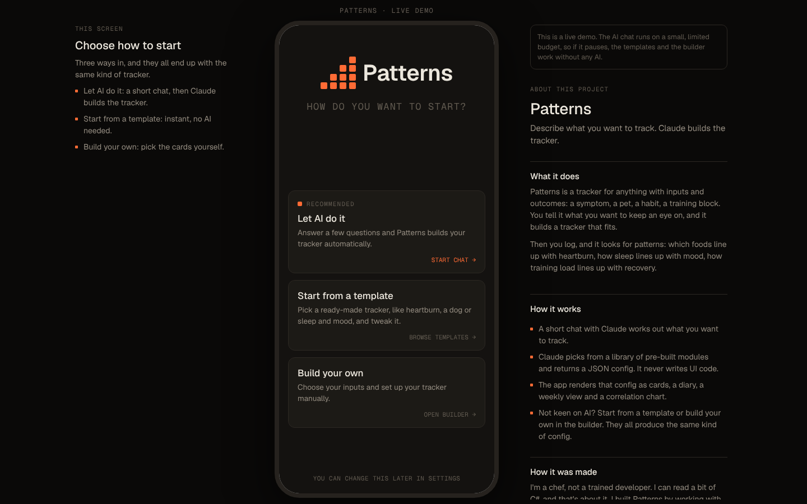
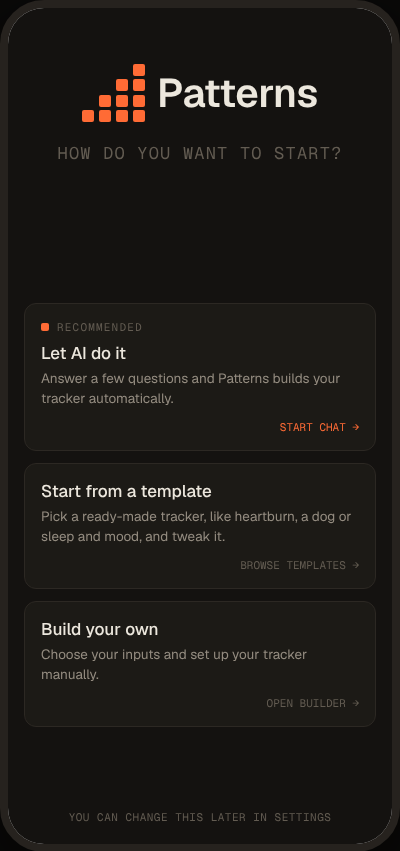
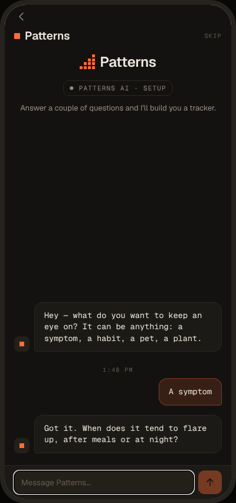
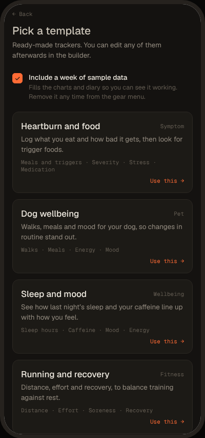
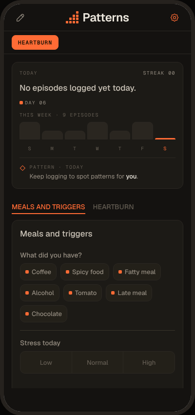
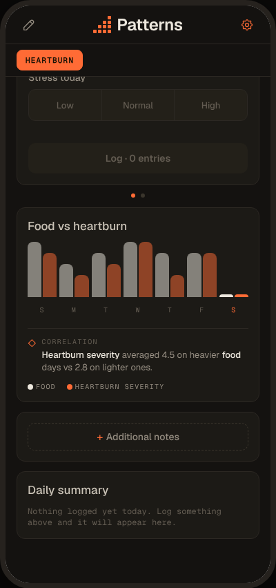
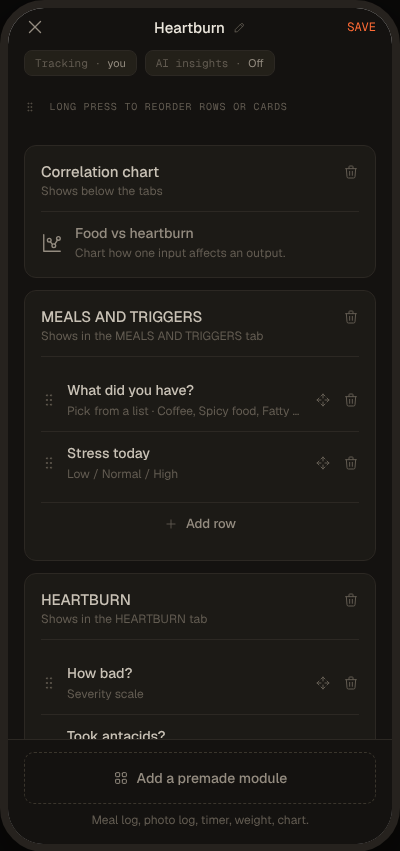

# Patterns

**Describe what you want to track. Claude builds the tracker.**

Patterns is a tracking app for anything that has inputs and outcomes: a symptom, a pet, a habit, a training block. You chat to Claude for a minute, it works out what matters, and the app builds a tracker to match. Then you log, and Patterns looks for patterns, such as which foods line up with heartburn, or how sleep lines up with mood.



> **Source:** https://github.com/Insightio-Prog/patterns  
> **Live demo:** _link coming soon_
> The AI chat runs on a small shared budget. Templates and the builder work without any AI.

## How I made it

I'm a chef, not a trained developer. I can read a little C#, and that's about it. I built Patterns by working with **Claude and Cursor**: I decide what the app should do and how it should feel, Claude and Cursor write the code, and I test it, break it and send it back. The part I bring is knowing what to ask for, spotting what's wrong and steering it until it works. This README, the architecture and the decisions below are mine; a lot of the typing was not.

## What it does

| | |
|---|---|
|  |  |
| **Three ways in.** Let AI build it, pick a template, or build your own. | **A short chat.** Claude asks a few questions, one at a time. |
|  |  |
| **Templates.** Ready-made trackers, no AI needed, with optional sample data. | **Your tracker.** Today and this week, input cards you swipe between. |
|  |  |
| **Patterns.** Inputs compared with outcomes. Sample data is always labelled. | **Builder.** Rename, add cards, reorder rows. AI-built cards are preserved. |

## How it works

```
 you  ──chat──▶  Claude (interview)  ──▶  <ready/>
                                              │
                         config request ◀─────┘
                               │
                    TrackerConfig (JSON)
                               │
        ┌──────────────────────┼───────────────────────┐
     modules              terminology               eventRows
  (cards, charts)      (copy for the subject)    (what counts as an episode)
                               │
                     rendered by the app
```

- **Claude never writes UI code.** It chooses from a library of pre-built modules (symptom, food, sleep, fitness, pet, plant and others, plus standalone inputs like scales, toggles, counters and chips) and returns a JSON `TrackerConfig`.
- **Config-driven UI.** One `TrackerConfig` type drives every screen. Templates, the builder and the AI all produce the same thing, so they are interchangeable.
- **Two-step generation.** The interview runs first. When Claude has enough it replies with `<ready/>`, and a second, larger request generates the config while a building screen shows.
- **Defensive parsing.** Replies can be truncated or malformed, so the app repairs partial JSON, normalises module names, enforces Notes and Diary on every tracker, and falls back to a simple default if all else fails.
- **Local only.** Data is stored on the device. There is no account and no backend database.

## The AI proxy

The browser never talks to Anthropic directly. It calls a small Cloudflare Worker (`worker/worker.js`) that:

- holds the **API key** as a secret
- owns the **model, system prompt and token limits**, so callers can only send the conversation
- validates requests (shape, size, allowed origins)
- applies **per-visitor and daily rate limits** (Workers KV)
- returns a friendly "demo budget used up" state when limits or credit run out

## Tech

- Expo, React Native and TypeScript, exported to the web with `expo-router` and `react-native-web`
- Claude (Sonnet) through the Cloudflare Worker above
- Cloudflare Workers + KV for the proxy
- Geist and Geist Mono for type

## Run it locally

```bash
npm install
npm run web
```

The AI chat needs the Worker. Set `EXPO_PUBLIC_AI_PROXY_URL` in `.env.local` to your own deployment of `worker/worker.js` (see `worker/wrangler.toml`), or use the templates and builder, which need nothing.

## What I'd improve

- Lock the proxy down further with bot checks (Turnstile) and a stricter budget.
- Let the builder edit the options on AI-built cards.
- Stronger pattern-finding than the current heavier-day versus lighter-day comparison.
- Automated tests for config parsing and normalisation.
- A free marketplace where people share the trackers they build.
